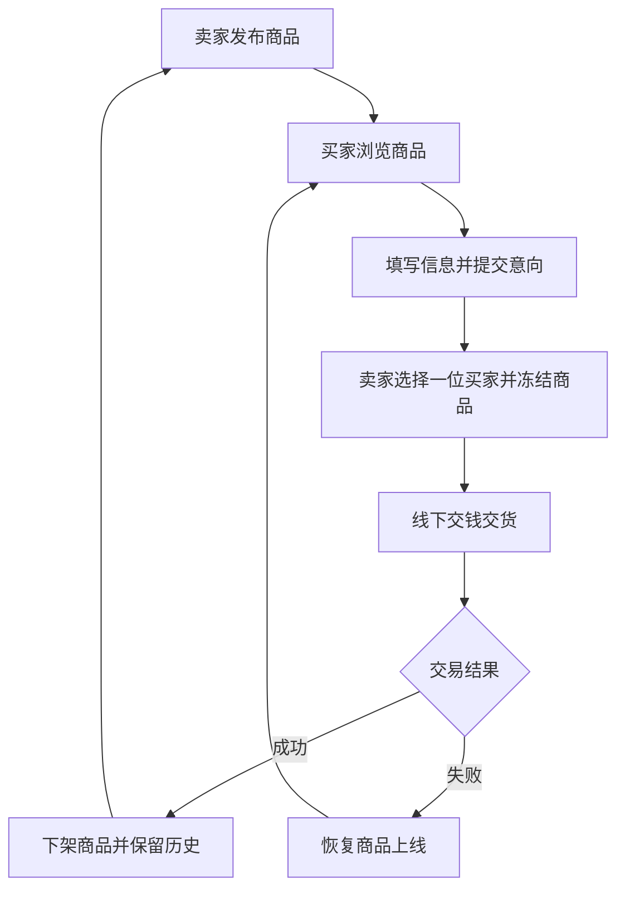

# 需求规格说明书

版本：第一次评审草稿，2026-10-08。实现范围仅为在线购物系统基线需求。

## 用户角色

买家无需注册，可浏览商品并在想购买时填写姓名、电话和备注。固定单一卖家登录后台，管理商品与线下交易。

## 功能用例与验收条件

| 编号 | 角色 | 功能 | 验收条件 |
|---|---|---|---|
| F01 | 买家 | 查看唯一商品 | 展示名称、描述、图片、价格；冻结状态可见但不能提交意向；无商品有空状态 |
| F02 | 买家 | 提交购买意向 | 无需账号；有效姓名和电话必填、备注选填；冻结或下架不能提交 |
| F03 | 卖家 | 登录和退出 | 固定卖家账号；未登录不能访问后台 API，退出后会话失效 |
| F04 | 卖家 | 发布商品 | 名称、描述、图片、正数价格必填；同时最多一件在售或冻结商品 |
| F05 | 卖家 | 查看商品历史 | 保留已售商品、发布时间和成交时间 |
| F06 | 卖家 | 查看意向买家 | 查看姓名、电话、备注与状态，买家信息不公开 |
| F07 | 卖家 | 冻结商品 | 选择该商品的有效买家意向；冻结后停止接收新意向 |
| F08 | 卖家 | 记录交易成功 | 冻结后线下成交，商品下架；所选意向成交，其余结束；可发布下一件 |
| F09 | 卖家 | 记录交易失败 | 冻结后失败，恢复上线并保留意向记录 |
| F10 | 卖家 | 修改密码 | 验证原密码；修改后旧会话失效 |

## 业务流程

提交意向不自动冻结；冻结仍占唯一名额；已售不占名额。没有注册、购物车、线上付款、多卖家、配送等升级功能。

## 接口与数据约定

前端采用同源 /api 请求，状态最终由后端校验。商品价格返回整数分、图片以 Data URL 提供。POST 接收 JSON，后台用会话 Cookie。具体接口和字段见 Wiki“前端接口与集成约定”；这是小组接入约定，后端成员上传后核对实际实现。

## 首次评审范围

本次已公开前端模块和配套说明。其他四个模块预计2026-10-07晚由本人上传；代码上传、集成、功能验收是三个独立检查点，不能用“准备上传”替代“已完成验收”。
